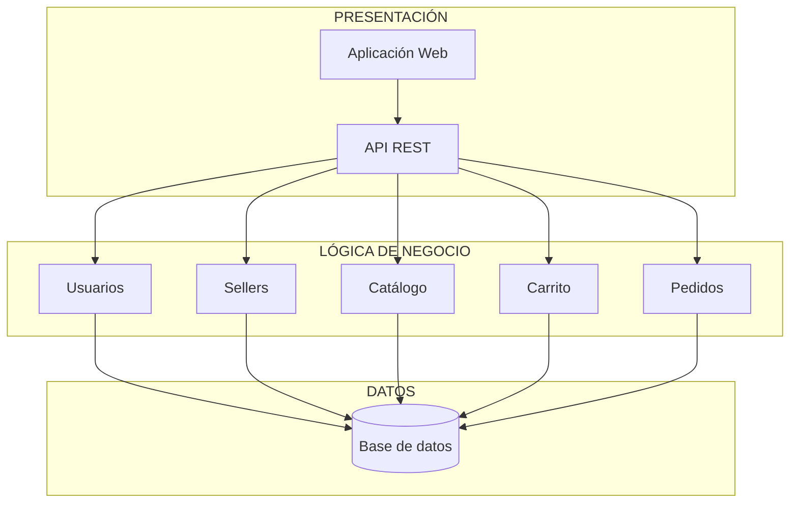
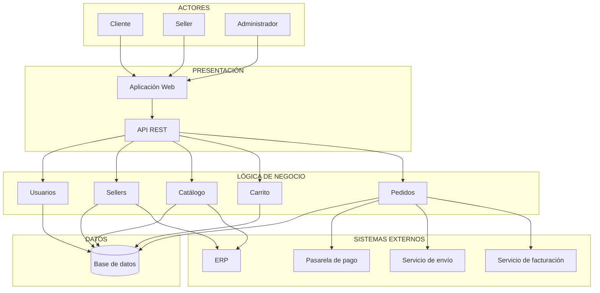

# Arquitectura inicial del sistema

## Ejercicio 09 - Arquitectura en capas

La arquitectura inicial del marketplace se organiza utilizando una arquitectura de tres capas:

1. **Presentación**
2. **Lógica de negocio**
3. **Datos**

### Arquitectura en capas

### Descripción de las capas

#### Presentación

Es la capa encargada de la interacción con los usuarios. Está compuesta por la **Aplicación Web** y la **API REST**, mediante las cuales los usuarios pueden acceder a las funcionalidades del marketplace.

#### Lógica de negocio

Contiene los módulos que implementan las principales funcionalidades del sistema:

- Usuarios
- Sellers
- Catálogo
- Carrito
- Pedidos

Esta capa procesa las solicitudes recibidas desde la presentación y aplica las reglas de negocio correspondientes.

#### Datos

Es la capa responsable del almacenamiento y consulta de la información del sistema mediante una **base de datos**.

---

# Ejercicio 10 - Diagrama final de arquitectura inicial

## Actores

Los principales actores que interactúan con el sistema son:

- Cliente
- Seller
- Administrador

## Sistemas externos

El marketplace también requiere integración con:

- Pasarela de pago
- Servicio de envío
- ERP
- Servicio de facturación

## Diagrama de arquitectura

## Descripción

La arquitectura inicial del marketplace se organiza en tres capas principales.

- **Presentación:** contiene la Aplicación Web y la API REST, permitiendo la interacción de los clientes, sellers y administradores con el sistema.
- **Lógica de negocio:** contiene los módulos de Usuarios, Sellers, Catálogo, Carrito y Pedidos, responsables de implementar las funcionalidades principales.
- **Datos:** contiene la base de datos utilizada para almacenar la información del sistema.

Además, la arquitectura contempla la integración con sistemas externos. El módulo de **Pedidos** se comunica con la pasarela de pago, el servicio de envío y el servicio de facturación. El módulo de **Catálogo** se integra con el ERP para obtener información relacionada con productos y stock.
