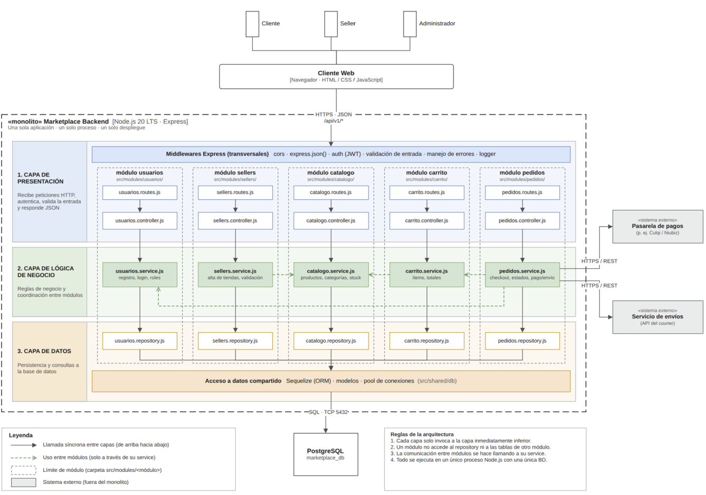
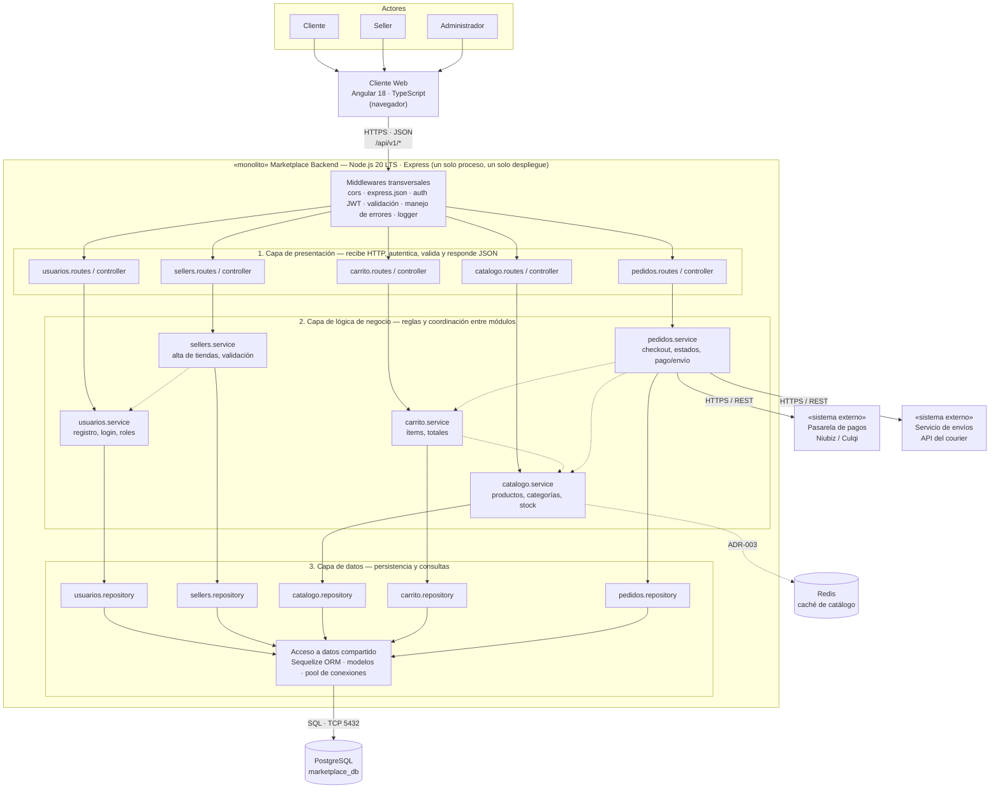
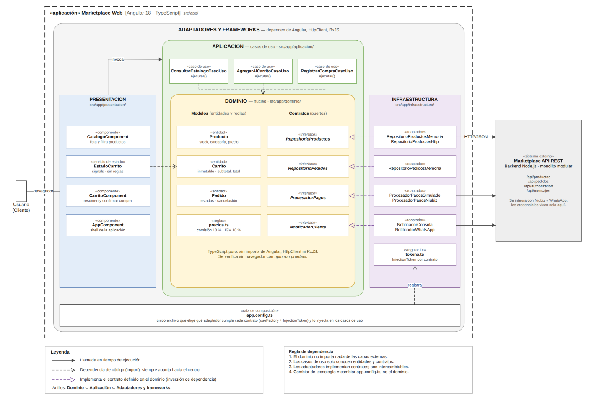
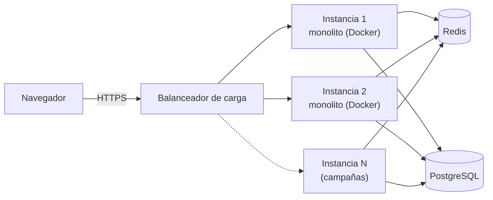

# 6. Estilo arquitectónico

> **Pregunta guía:** ¿Cómo estructuramos globalmente el sistema?

## Estilo seleccionado

**Cliente-servidor + Monolito modular en capas.**

| Concepto             | Qué significa en este proyecto                                                                                                         |
| -------------------- | -------------------------------------------------------------------------------------------------------------------------------------- |
| **Cliente-servidor** | El frontend (Angular 18) se ejecuta en el navegador y consume el backend mediante API REST (HTTPS + JSON).                             |
| **Monolito**         | El backend (Node.js 20 + Express) es **una sola aplicación, un solo proceso, un solo despliegue** y una sola base de datos PostgreSQL. |
| **Modular**          | Dentro del monolito, cada funcionalidad es un módulo con límites claros: `usuarios`, `sellers`, `catalogo`, `carrito`, `pedidos`.      |
| **En capas**         | Cada módulo se divide en presentación (routes/controller), lógica de negocio (service) y datos (repository).                           |

> Capas = organización **lógica**. Monolito = unidad de **despliegue**.
> Ambos conceptos coexisten.

## Justificación (trazabilidad con drivers)

| Driver                | Cómo lo atiende el estilo                                                                                                                |
| --------------------- | ---------------------------------------------------------------------------------------------------------------------------------------- |
| DA01 – Escalabilidad  | El monolito se replica horizontalmente detrás de un balanceador; los módulos permiten extraer un microservicio si un módulo lo necesita. |
| DA02 – Rendimiento    | Caché (Redis) frente al módulo de catálogo; llamadas en proceso, sin latencia de red entre módulos.                                      |
| DA03 – Seguridad      | Middleware transversal de autenticación (JWT), validación de entrada y HTTPS.                                                            |
| DA04 – Pago externo   | El módulo `pedidos` se integra con la pasarela mediante un adaptador HTTPS/REST.                                                         |
| DA05 – API REST       | Frontend y backend separados; contrato `/api/v1/*`.                                                                                      |
| DA06 – Mantenibilidad | Módulos independientes; cada módulo solo usa a otro a través de su _service_.                                                            |

## Alternativas descartadas

| Estilo            | Motivo                                                                                                  |
| ----------------- | ------------------------------------------------------------------------------------------------------- |
| Microservicios    | Alto costo operativo para un equipo pequeño y un dominio en evolución.                                  |
| SOA / ESB         | Pensado para integrar muchos sistemas corporativos; excesivo aquí.                                      |
| Event-driven puro | Útil para notificaciones/envíos asíncronos (se puede incorporar luego), pero no como estructura global. |
| Serverless        | Dificulta transacciones de compra y genera dependencia del proveedor cloud.                             |

## Diagrama de arquitectura (estructura global)

Versión en Mermaid (incluye además la caché Redis del ADR-003):

**Leyenda**

- Flecha continua: llamada síncrona entre capas (de arriba hacia abajo).
- Flecha punteada entre services: uso entre módulos (solo a través de su _service_).
- Cilindros: almacenamiento. Cajas «sistema externo»: fuera del monolito.

## Estructura interna del cliente web (Angular)

El nodo **Cliente Web** del diagrama anterior se organiza internamente con
Clean Architecture: Presentación, Aplicación (casos de uso), Dominio e
Infraestructura (adaptadores), con `app.config.ts` como raíz de composición.
Los adaptadores HTTP consumen la **Marketplace API REST** del monolito.

## Reglas de la arquitectura

1. Cada capa solo invoca a la capa inmediatamente inferior.
2. Un módulo no accede al _repository_ ni a las tablas de otro módulo.
3. La comunicación entre módulos se hace llamando a su _service_.
4. Todo se ejecuta en un único proceso Node.js con una única base de datos.
5. Los sistemas externos (pagos, envíos) se consumen siempre mediante adaptadores (ADR-004).

## Despliegue

La aplicación es **una sola imagen** que se replica; escalar en campaña es
levantar más instancias, sin cambiar código (DA01).
