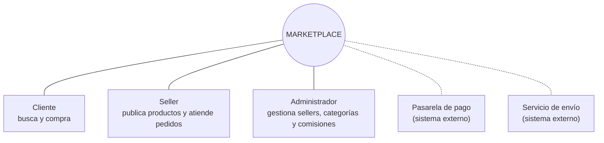

# 1. Necesidad del negocio

> **Pregunta guía:** ¿Qué problema queremos resolver?

## Contexto

Se desea desarrollar un **marketplace de productos para mascotas** en el que
diferentes *sellers* (tiendas, veterinarias, distribuidores) publiquen sus
productos y los clientes puedan buscarlos, agregarlos a un carrito y comprarlos
en línea. Se toma como referencia funcional a GoPet (https://www.gopet.pe/).

El marketplace no vende productos propios: **intermedia** entre clientes y
sellers y cobra una **comisión** por cada venta.

## Participantes

## Problema

| Situación actual | Consecuencia |
|------------------|--------------|
| Los dueños de mascotas compran en tiendas dispersas, cada una con su propio canal (redes sociales, WhatsApp, tienda física). | Difícil comparar precios y disponibilidad; compras lentas. |
| Los sellers pequeños no tienen una tienda en línea propia ni integración con pagos y envíos. | Pierden ventas fuera de su zona. |
| Cobro y despacho se coordinan manualmente. | Errores en montos, pedidos sin seguimiento, carritos abandonados. |

## Objetivos del negocio

| ID | Objetivo | Indicador |
|----|----------|-----------|
| ON01 | Aumentar las ventas en línea de los sellers afiliados. | Ventas mensuales por seller. |
| ON02 | Mejorar la experiencia de compra del cliente (buscar, comparar y pagar en un solo lugar). | Tasa de conversión, carritos abandonados. |
| ON03 | Integrar varios medios de pago y servicios de envío. | Nº de medios de pago / couriers integrados. |
| ON04 | Reducir el abandono del carrito. | % de carritos que terminan en pedido. |
| ON05 | Generar ingresos para el marketplace mediante comisión por venta (10 %). | Ingresos por comisión. |

## Resultado

Objetivos del negocio que guían el resto del proceso: mayor alcance, más
ingresos para sellers y marketplace, y mayor satisfacción del cliente.
