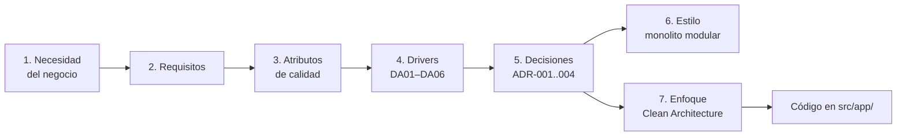

# Arquitectura del Marketplace de productos para mascotas

Curso: **IS-488 Arquitectura de Software** · UNSCH · Semestre 2026-II
Guía 03 — Análisis y selección de estilos y enfoques arquitectónicos
Caso de estudio: marketplace tipo [GoPet](https://www.gopet.pe/)

Esta carpeta documenta el proceso de arquitectura del proyecto. No agrega
funcionalidades: registra **qué** necesita el negocio, **qué** condiciona el
diseño y **por qué** el sistema está organizado como está.

## Entregables

| N.º | Etapa | Documento | Resultado |
|----|-------|-----------|-----------|
| 1 | Necesidad del negocio | [01-necesidad-negocio.md](01-necesidad-negocio.md) | Objetivos del negocio |
| 2 | Requisitos | [02-requisitos.md](02-requisitos.md) | RF, RNF y restricciones |
| 3 | Atributos de calidad | [03-atributos-calidad.md](03-atributos-calidad.md) | Prioridades de calidad |
| 4 | Drivers arquitectónicos | [04-drivers-arquitectonicos.md](04-drivers-arquitectonicos.md) | Drivers priorizados (DA01–DA06) |
| 5 | Decisiones arquitectónicas | [05-decisiones-arquitectonicas.md](05-decisiones-arquitectonicas.md) | ADR-001 a ADR-004 |
| 6 | Estilo arquitectónico | [estilo-arquitectonico.md](estilo-arquitectonico.md) | Monolito modular en capas |
| 7 | Enfoque arquitectónico | [enfoque/enfoque-arquitectonico.md](enfoque/enfoque-arquitectonico.md) | Clean Architecture |

## Trazabilidad



## Cómo ver los diagramas

Los diagramas están escritos en **Mermaid** dentro de los propios `.md`.
En VS Code instale la extensión *Markdown Preview Mermaid Support* y abra la
vista previa con `Ctrl+Shift+V`. GitHub también los renderiza directamente.

## Verificación del proyecto

```bash
npm install
npm run pruebas   # 16 pruebas del dominio, sin Angular
npm start         # http://localhost:4200
```
