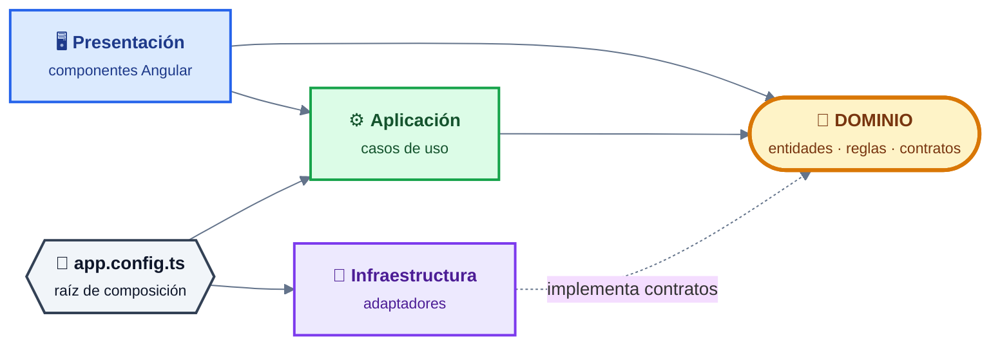
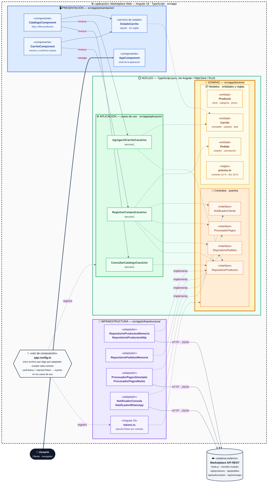
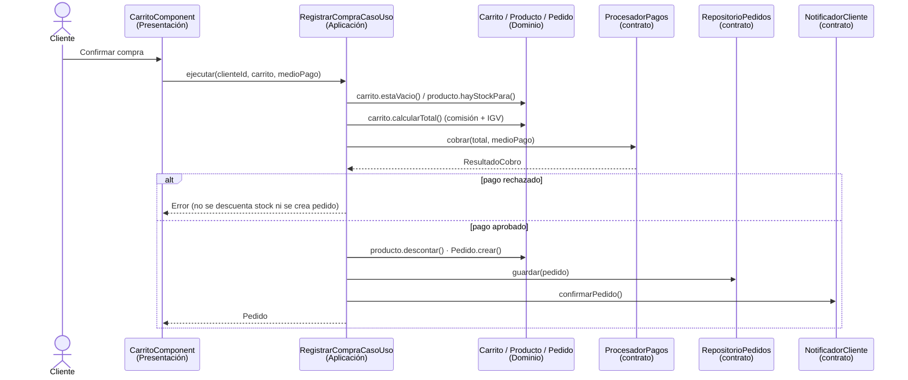

# 7. Enfoque arquitectónico: Clean Architecture

> **Pregunta guía:** ¿Qué estructura arquitectónica aplicaremos para organizar
> responsabilidades y dependencias internas?

## Ficha del enfoque

| Elemento | Descripción aplicada al Marketplace |
|----------|-------------------------------------|
| Patrón / enfoque arquitectónico | Clean Architecture (Arquitectura Limpia). |
| Objetivo | Separar responsabilidades y controlar las dependencias hacia el dominio. |
| ¿Qué problema resuelve? | Evita el acoplamiento entre la interfaz Angular, las reglas del negocio y las tecnologías externas, como bases de datos, API y servicios de pago. |
| Capas definidas | Presentación, Aplicación, Dominio e Infraestructura. |
| Beneficios | • Facilita el mantenimiento y las pruebas unitarias.<br>• Permite cambiar implementaciones técnicas sin modificar innecesariamente las reglas del negocio.<br>• Mejora la organización y separación de responsabilidades del código. |
| Driver / ADR | DA06 – Mantenibilidad · ADR-002 (y ADR-004 para pagos). |

## Regla de dependencia

> Las dependencias del código **siempre apuntan hacia el centro** (dominio).
> El dominio no sabe que existen Angular, HttpClient, la API ni la pasarela.



## Responsabilidades por capa (mapeadas al código)

| Carpeta | Capa | Contiene | Archivos en el proyecto | Puede importar |
|---------|------|----------|-------------------------|----------------|
| `src/app/dominio/modelos/` | Dominio – entidades | Entidades y reglas de negocio | `producto.modelo.ts` (stock, categoría), `carrito.modelo.ts` (inmutable, totales), `pedido.modelo.ts` (estados, cancelación), `precios.ts` (comisión 10 %, IGV 18 %) | Nada externo |
| `src/app/dominio/contratos/` | Dominio – puertos | Interfaces que el negocio necesita | `RepositorioProductos`, `RepositorioPedidos`, `ProcesadorPagos`, `NotificadorCliente` | Solo modelos del dominio |
| `src/app/aplicacion/` | Aplicación | Casos de uso: orquestan el flujo | `ConsultarCatalogoCasoUso`, `AgregarAlCarritoCasoUso`, `RegistrarCompraCasoUso` | Solo `dominio/` |
| `src/app/infraestructura/` | Infraestructura | Adaptadores que implementan contratos | `RepositorioProductosMemoria` / `Http`, `RepositorioPedidosMemoria`, `ProcesadorPagosSimulado` / `Niubiz`, `NotificadorConsola` / `WhatsApp`, `tokens.ts` | `dominio/` + Angular, HttpClient, RxJS |
| `src/app/presentacion/` | Presentación | Pantallas y estado de la UI | `CatalogoComponent`, `CarritoComponent`, `EstadoCarrito`, `AppComponent` | `aplicacion/`, `dominio/` + Angular |
| `src/app/app.config.ts` | Raíz de composición | Elige qué adaptador cumple cada contrato | Único archivo que nombra implementaciones concretas | Todas las capas |

## Diagrama del enfoque (aplicación Angular)



| Color | Capa | Rol |
|:-----:|------|-----|
| 🟦 | **Presentación** | Componentes Angular y estado de la UI |
| 🟩 | **Aplicación** | Casos de uso que orquestan el flujo |
| 🟨 | **Dominio** | Entidades, reglas y contratos (centro del sistema) |
| 🟪 | **Infraestructura** | Adaptadores intercambiables que implementan los contratos |
| ⬜ | **Raíz de composición / externo** | `app.config.ts` y la API REST del backend |

> 📊 Versión interactiva (Archify): [enfoque-arquitectonico.html](./enfoque-arquitectonico.html) · fuente [enfoque-arquitectonico.architecture.json](./enfoque-arquitectonico.architecture.json)

**Leyenda**

- Flecha continua: llamada en tiempo de ejecución.
- Flecha punteada: dependencia de código (`import`); siempre apunta hacia el centro.
- «implementa»: el adaptador cumple el contrato definido en el dominio (**inversión de dependencias**, la "D" de SOLID).
- Anillos: **Dominio ⊂ Aplicación ⊂ Adaptadores y frameworks**.

## Flujo de un caso de uso: Registrar una compra



- El **caso de uso** decide el orden de los pasos.
- Las **entidades** deciden qué es válido.
- Los **contratos** ocultan con qué tecnología se hace cada cosa.

## Auditoría de dependencias del proyecto

Revisión de las líneas `import` del boilerplate:

| Capa | ¿Importa Angular / HttpClient / RxJS? | Resultado |
|------|---------------------------------------|-----------|
| `dominio/` | No. Solo se importa a sí mismo. | ✅ Cumple |
| `aplicacion/` | No. Solo importa `dominio/`. | ✅ Cumple |
| `infraestructura/` | Sí (`HttpClient`, `InjectionToken`, `firstValueFrom`). Importa contratos del dominio. | ✅ Correcto: es la capa externa |
| `presentacion/` | Sí (Angular). Importa casos de uso y modelos del dominio. | ✅ Cumple (apunta hacia adentro) |
| `app.config.ts` | Conoce todas las capas. | ✅ Es la raíz de composición |

**Verificación mecánica:** `tsconfig.pruebas.json` compila solo `dominio/`,
`aplicacion/` y los adaptadores en memoria. Si alguna de esas capas importara
Angular, la compilación fallaría. Resultado de `npm run pruebas`:
**16 pruebas OK en ~11 ms, sin levantar Angular.**

## Cómo cambiar una tecnología sin tocar el negocio

| Cambio | Qué se modifica | Qué **no** se modifica |
|--------|-----------------|------------------------|
| Catálogo en memoria → API REST | `app.config.ts`: usar `RepositorioProductosHttp` | Dominio, casos de uso, componentes |
| Pago simulado → Niubiz | `app.config.ts`: usar `ProcesadorPagosNiubiz` | Dominio, `RegistrarCompraCasoUso` |
| Consola → WhatsApp | `app.config.ts`: usar `NotificadorWhatsApp` | Dominio, casos de uso |
| Agregar caché (ADR-003) | Nuevo adaptador decorador de `RepositorioProductos` | Dominio, casos de uso |

## Aplicación al backend (misma idea, otro lado del monolito)

Cada módulo del monolito Node.js puede aplicar las mismas capas:

```
src/modules/pedidos/
├── dominio/           Pedido, reglas de estado, contratos (PedidoRepository, PasarelaPago)
├── aplicacion/        CrearPedido, ConfirmarCompra, CancelarPedido
├── adaptadores/       pedidos.controller.js, pedidos.routes.js, PedidoDTO
└── infraestructura/   PostgresPedidoRepository, NiubizPaymentGateway, ShippingAdapter
```
